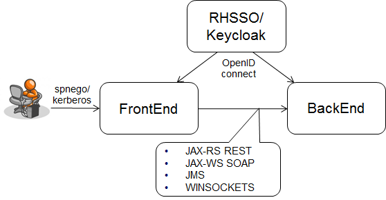

# JEE Instruction and Example application

This application wraps all JEE7+ technologies which are currently used at nocom in one single application. The deployment out of this is being used by the JAS team to do assessments on JBoss EAP platform releases and surrounding infrastructure like MQ MOM, Keycloak and Oracle DB drivers. The application is pieced together from examples taken from the RedHat Wildfly Java EE7 samples [GitHub](https://github.com/wildfly/quickstart).
Meanwhile try to set the bare minimum requirements for engineering easy to understand (KISS), maintainable and extensible business applications, [please read to understand why this is important](http://www.itexico.com/blog/bid/99765/software-development-kiss-yagni-dry-3-principles-to-simplify-your-life). 

Picture above shows three participants (left to right):
* IE client, authenticating itself to a JEE web application over SPNEGO/Kerberos. Authentication handshake delegated to the central RHSSO/Keycloak server, which is backed up by DNS server and KDC to validating the Kerberos token. Along the road authorization will be propagated downstream through OpenID connect JWT tokens provided by Keycloak, read [Securing Microservices with Keycloak](http://www.codingpedia.org/keycloak/securing-microservices-with-keycloak/).
* Frontend is a typical non-persistent JEE web application, delegating its lookups downstream to backing up services over REST or any other kind of transport mechanism. It shows technologies like JSF, CDI, JSON P, RestEasy Client Proxy Framework, JMS and JAX-WS client.
* Backend is presenting the scenario of a backing service persisting data on a Oracle DB and servicing out its content over JAX-RS, JAX-WS SOAP and JMS.

## FrontEnd

Web application frontend, demonstrating the following JEE technologies.

* JSF
* CDI
* RestEasy JAX-RS [Proxy Client Framework](documentation/ProxyFramework.md)
* JAX-WS client stub
* [WebSockets](documentation/WebSockets.md)
* [JMS Producer](documentation/JmsProducer.md)
* JSON Processing (JSR-353) API

## BackEnd

Business logic and data persisting backend on Oracle DB, exposing its services through REST, SOAP, JMS and WinSockets.

* JPA - Oracle persistency
* [JMS Consumer](http://www.mastertheboss.com/jboss-server/jboss-jms/jms-20-tutorial-on-wildfly-as)
* JAX-WS
* RestEasy [JAX-RS Endpoints](documentation/RestEndpoint.md)
* JSON P
* JAXB
* CDI
* Bean validation
* JSON Processing (JSR-353) API

## Cross Cutting 

* Authentication and Authorization through [KeyCloak](documentation/Keycloak.md).
* How to log and [track Transaction Boundaries](documentation/TransactionTracking.md) boundaries over distributed calls.
* [Exception Handling](documentation/ExceptionHandling.md) and Exception handling contextual with Commons Lang3 ContextedRuntimeException
* [Application Configuration](documentation/Configuration.md) concerns.
* and more, to be extended here
