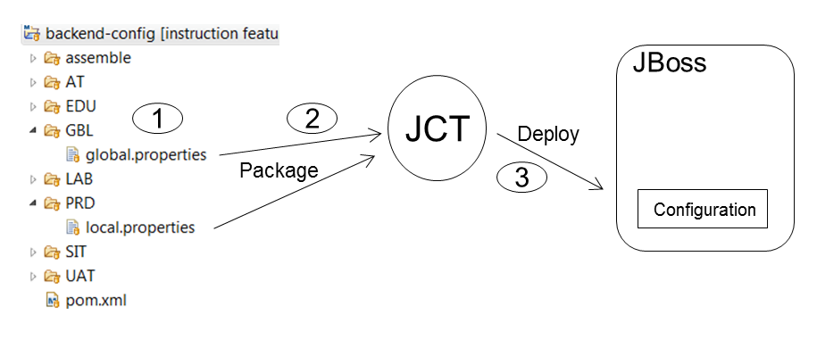

# Application Configuration

There are two types of configuration artefacts to be considered for JEE applications.
 
1. Environment specific system configuration related to deployment specific concepts like environment specific Data Stores, REST or SOAP Service Endpoints. These configuration items generally are decided upon packaging and deployment time and are under responsibility of the operational staff.
2. Application properties, designed and implemented together with the business logic. These configuration artefacts kept with the source code under SCM (GIT) and compiled, tested and packaged together with program code. 

Picture above depicts the process of bringing Application specific configuation artefacts from GIT repo to JBoss Runtime.

1. Application property files are kept on a separate Maven Config module which is instrumented with the Maven Assembly plugin. This plugin will package the directory structure with content to a ZIP file. This ZIP file will be uploaded to NEXUS repo during Maven Release build on Jenkins. 
2. JCT JBoss Config Tool will pull the ZIP file from NEXUS and will package the GLB part (global.properties) and the environment specific, this case PRD (local.properties) on a deployment package.
3. Both global and local properties files will reside on the JBoss Runtime configuration directory, available to be consumed by the business application. 

#### Consuming System Property
JBoss system properties (environment specific system configuration discussed earlier) will be injected through the CDI producer [SystemPropertyProvider](../common/src/main/java/com/nocom/inst/cdi/SystemPropertyProvider.java). Through this mechanism you can inject properties on CDI bean with @Inject like on [MemberResourceRESTService](../backend-web/src/main/java/com/nocom/inst/rest/MemberResourceRESTService.java).

#### Consuming Application Property
Application property files are loaded on alphabetical order, starting with global and then local. This allows the developer to specify only once properties on global level which apply for all environment, with the advantage of being able to overwrite the property on an environment specific level. Application properties are CDI @injected through the CDI producer [ApplicationPropertyProvider](../common/src/main/java/com/nocom/inst/cdi/ApplicationPropertyProvider.java).  Through this mechanism you can inject properties on CDI bean with @Inject like on [MemberResourceRESTService](../backend-web/src/main/java/com/nocom/inst/rest/MemberResourceRESTService.java).
