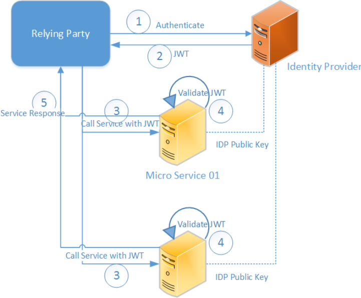

# Securing REST Endpoints with RHSSO (aka Keycloak)

Authorizing REST endpoints with Keycloak is done with OpenID Connect JWT tokens. Passing these tokens to the endpoint is done through a JAX-RS client request filter implemented through class [BaererTokenFilter](../common/src/main/java/com/nocom/inst/keycloak/BaererTokenFilter.java).

1. Web application (Relying Party) authenticates to Keycloak server over SPNEGO SSO.
2. Keycloak send valid JWT access token based on centrally configured access policies, which allows access to MS 1 and 2.
3. Call service MS1 over JAX-RS (REST) through JAX-RS [ClientBuilder](../frontend-web/src/main/java/com/nocom/inst/util/Resources.java). JWT token is propagated over the HTTP Headers through JAX-RS [ClientRequestFilter](../common/src/main/java/com/nocom/inst/keycloak/BaererTokenFilter.java).
4. IDP (Identity Profile which is Keycloak) public key, allowing the MS to validate token is provided on the WAR deployment as [keycloak.json](../backend-web/src/main/webapp/WEB-INF/keycloak.json) 

