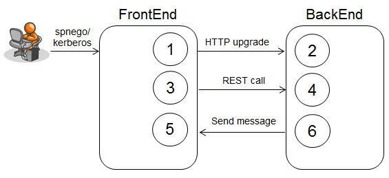

# Websockets using Endcoders and Decoders

WebSockets are a new way for Web clients to communicate with servers and vice versa, without the overhead of an HTTP protocol. Using a WebSocket connection, Web applications can perform real-time communication instead of having to poll for changes back and forth. A Websocket can use a Decoder to transform a text message into a Java object and then handle it in the @OnMessage method; whenever an object is written to the Session, a Websocket will use an Encoder to convert the object to text and send it back to the client, like demonstrated in the following Use Case.

1. WebSockets [ClientEndpoint](../frontend-web/src/main/java/com/nocom/inst/websockets/MemberClientEndpoint.java) initially connects server over HTTP upgrading the connection to the WebSocket protocol.
2. [ServerEndpoint](../backend-web/src/main/java/com/nocom/inst/websockets/MemberEndpoint.java) proceeds after the handshake by registring the client session on the [SessionRegistry](../backend-web/src/main/java/com/nocom/inst/websockets/SessionRegistry.java).
3. FrontEnd calls BackEnd over REST to register a new Member record.
4. [ServerEndpoint](../backend-web/src/main/java/com/nocom/inst/service/MemberRegistration.java) stores record in DB and fires a CDI event. WebSocket [ServerEndpoint](../backend-web/src/main/java/com/nocom/inst/websockets/MemberEndpoint.java) observes the CDI event and sends out WebSocket messages to all WebSocket sessions and clients restired on [SessionRegistry](../backend-web/src/main/java/com/nocom/inst/websockets/SessionRegistry.java). Messages are JSON encoded with [JSONEncoder](../common/src/main/java/com/nocom/inst/websockets/JSONEncoder.java).
5. FrontEnd receives WebSocket message on [ClientEndpoint](../frontend-web/src/main/java/com/nocom/inst/websockets/MemberClientEndpoint.java) and unmarshalls message through [JSONDecoder](../common/src/main/java/com/nocom/inst/websockets/JSONDecoder.java).

